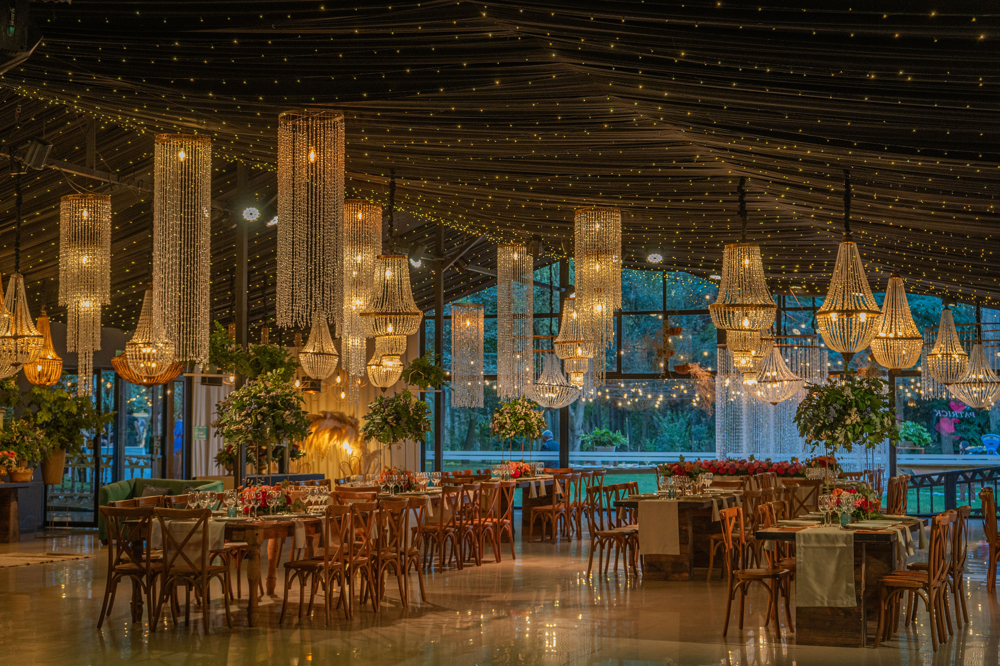
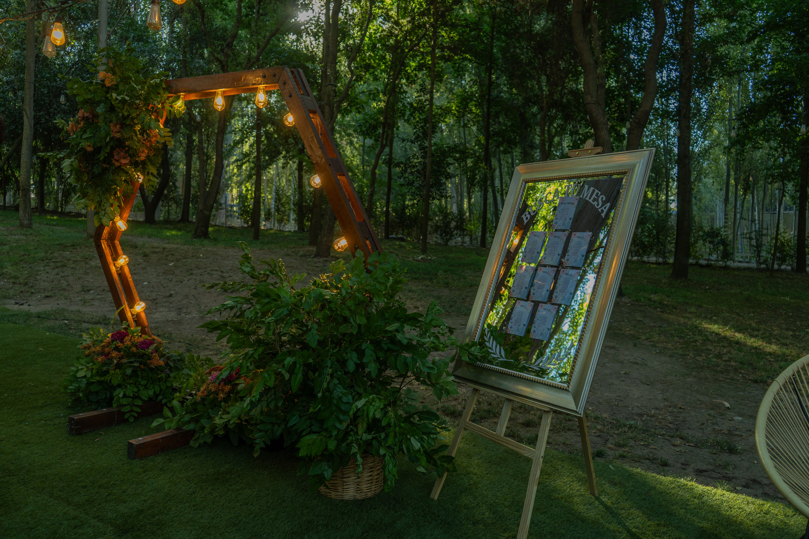
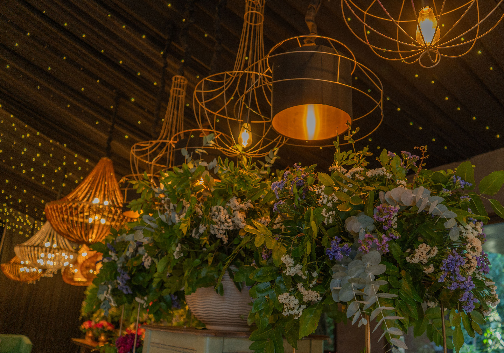
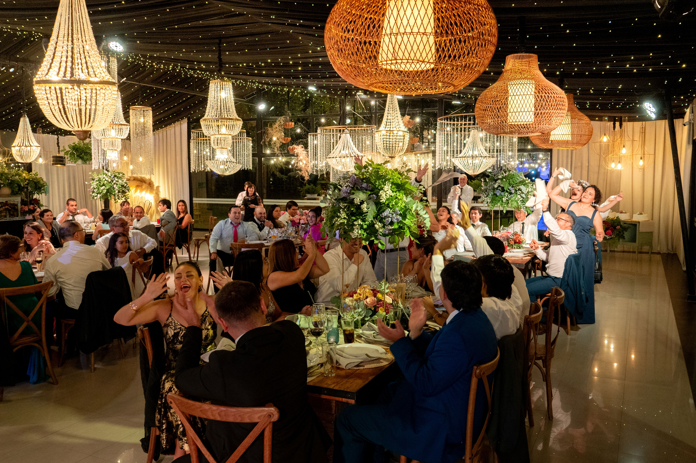

<div align="center">



# 🍽️ Banquetería Bórquez

**Elevando tus eventos a una experiencia gastronómica inolvidable.**

[](https://nextjs.org/)
[](https://reactjs.org/)
[](https://tailwindcss.com/)
[](https://www.framer.com/motion/)
[](https://www.typescriptlang.org/)

[Explorar Web](https://banqueteria-borquez-website.vercel.app/) • [Servicios](#-servicios) • [Centros de Eventos](#-centros-de-eventos) • [Contacto](#-contacto)

</div>

---

## 🌟 Sobre el Proyecto

Banquetería Bórquez es una plataforma web moderna y elegante diseñada para presentar servicios de banquetearía integral de alta gama. El sitio combina una estética refinada con una experiencia de usuario fluida, destacando la unión entre la **sofisticación gastronómica** y el **entorno natural**.

### ✨ Características Principales

- **🎨 Diseño Premium**: Interfaz visualmente impactante con animaciones fluidas utilizando GSAP y Framer Motion.
- **📱 Responsive Design**: Totalmente optimizado para dispositivos móviles, tablets y escritorio.
- **🖼️ Galería Interactiva**: Visualización de eventos y platillos con efectos de zoom y transiciones suaves.
- **🤖 Chat AI Intregado**: Asistente virtual vía n8n para resolver dudas frecuentes de los clientes.
- **📍 Centros de Eventos**: Selección exclusiva de lugares con mapas y detalles específicos.

---

## 🛠️ Stack Tecnológico

El proyecto utiliza las últimas tecnologías del ecosistema web para garantizar rendimiento y escalabilidad:

| Tecnología | Propósito |
| :--- | :--- |
| **Next.js 15/16** | Framework React con Server Components y Turbopack. |
| **Tailwind CSS 4** | Estilizado moderno con el nuevo motor de compilación rápida. |
| **Framer Motion** | Animaciones de componentes y transiciones de estado. |
| **GSAP** | Animaciones complejas de scroll y efectos visuales avanzados. |
| **Radix UI** | Componentes primitivos accesibles y sin estilo. |
| **n8n Chat** | Integración de asistente inteligente. |

---

## 📂 Estructura del Proyecto

```bash
banqueteria-borquez-website/
├── app/                # Rutas y páginas de Next.js (App Router)
├── components/         # Componentes React reutilizables
│   ├── ui/             # Componentes base de la interfaz (Shadcn/ui)
│   ├── hero.tsx        # Sección de impacto principal
│   └── ...
├── hooks/              # Custom React Hooks
├── lib/                # Utilidades y funciones auxiliares
├── public/             # Imágenes, iconos y fuentes estáticas
└── styles/             # Archivos CSS globales y temas
```

---

## 🚀 Inicio Rápido

Sigue estos pasos para ejecutar el proyecto localmente:

1. **Clonar el repositorio:**
   ```bash
   git clone https://github.com/PabloVasquezC/banqueteria-borquez-website.git
   cd banqueteria-borquez-website
   ```

2. **Instalar dependencias:**
   ```bash
   pnpm install
   ```

3. **Ejecutar el servidor de desarrollo:**
   ```bash
   pnpm run dev
   ```

4. **Abrir en el navegador:**
   Visita `http://localhost:3000` para ver el resultado.

---

## 📸 Vista Previa

<div align="center">

| Gastronomía de Autor | Entornos Naturales | Detalle en el Servicio |
| :---: | :---: | :---: |
|  |  |  |

</div>

---

## 📞 Contacto

Para consultas sobre el desarrollo o el servicio de banquetería:

- **Web:** [borquezbanqueteria.com](https://borquezbanqueteria.com)
- **Desarrollador:** Pablo Vásquez C.

---

<p align="center">
  Realizado con ❤️ para celebrar tus momentos especiales.
</p>
